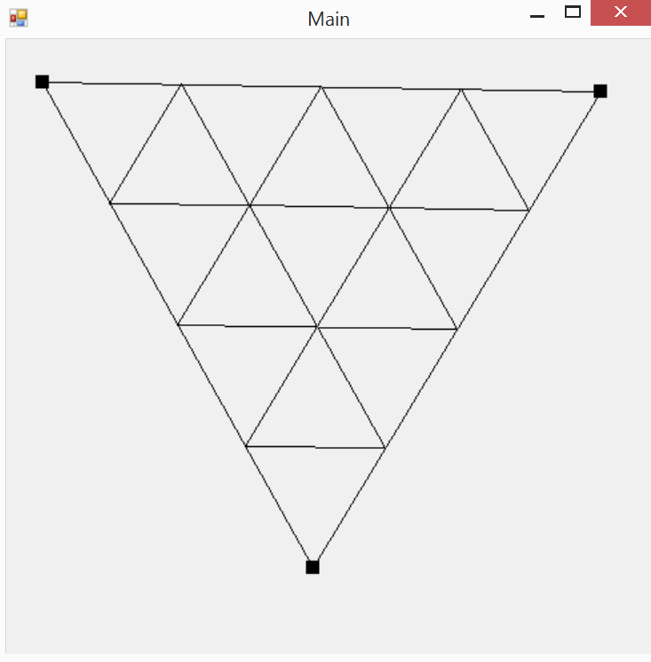

# C-Sharp-Recursive-Triangle
Recursive Triangle

## Beschreibung
Ein kleines Programm welches anhand 3 gegebener Punkte ein Dreieck erstellt. Dieses Dreieck wird eine bestimmte Zahl andhand der Mittelpunkte der Linien in weitere Dreiecke aufgeteilt. Dies geschieht so oft wie man selber angegeben hat.

## Verbesserungen
Ich würde den Code noch ein bisschen verständlicher gestalten und den User-Input noch anzeigen lassen.

## Bilder

Hier sieht man nur die 1. Ebene

Hier sieht man die ersten beiden Ebenen
